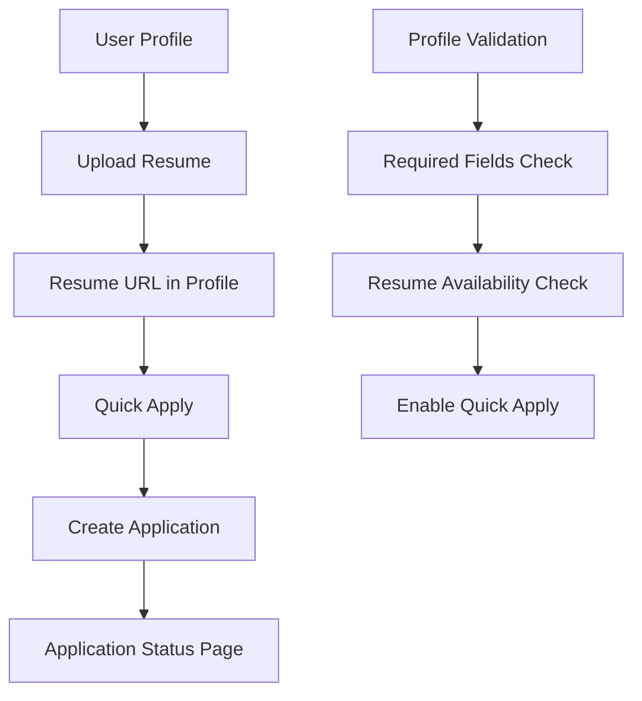

# CareerFlow - Candidate Point of View (POV) Documentation

## Table of Contents
1. [Overview](#overview)
2. [Authentication & User Management](#authentication--user-management)
3. [Profile Management](#profile-management)
4. [Resume Upload System](#resume-upload-system)
5. [Job Application System](#job-application-system)
6. [Quick Apply Functionality](#quick-apply-functionality)
7. [File Management](#file-management)
8. [Data Flow & Interactions](#data-flow--interactions)
9. [Database Schema](#database-schema)
10. [API Endpoints](#api-endpoints)
11. [UI Components](#ui-components)
12. [Error Handling](#error-handling)
13. [Future Considerations](#future-considerations)

---

## Overview

CareerFlow is a job board platform with a comprehensive candidate experience. The candidate POV includes profile management, resume uploads, job applications, and Quick Apply functionality. This documentation covers all aspects from the candidate's perspective.

### Key Features for Candidates:
- **Profile Management**: Complete profile setup with validation
- **Resume Upload**: PDF resume upload with persistence
- **Job Applications**: Apply to jobs with resume attachment
- **Quick Apply**: One-click job applications
- **Application Tracking**: View application status and history
- **File Management**: Upload and manage resume files

---

## Authentication & User Management

### User Authentication Flow
```javascript
// AuthContext.jsx - Main authentication context
const { user } = useAuth();
```

### User Data Structure
```javascript
// User object from Google OAuth
{
  id: "100236442534619013178", // Google social ID
  email: "edithboonsspidey@gmail.com",
  firstName: "Benduapparao",
  lastName: "Cse",
  name: "avengefaller",
  profileImageUrl: "https://...",
  provider: "google"
}
```

### User Sync Process
1. **Initial Login**: User signs in with Google OAuth
2. **Convex Sync**: User data synced to Convex database
3. **Profile Creation**: User record created in `users` table
4. **Data Preservation**: Existing profile data preserved during sync

### Key Files:
- `src/context/AuthContext.jsx` - Authentication context
- `convex/users.ts` - User management mutations/queries
- `src/api/apiUsers.js` - User API hooks

---

## Profile Management

### Profile Page Structure
**File**: `src/pages/profile.jsx`

### Profile Data Model
```javascript
const formData = {
  firstName: '',
  lastName: '',
  email: '',
  phone: '',
  location: '',
  bio: '',
  skills: [],
  experienceYears: 0,
  currentPosition: '',
  currentCompany: '',
  linkedinUrl: '',
  githubUrl: '',
  portfolioUrl: '',
  resumeUrl: '', // Critical for Quick Apply
  resumeFile: null,
  certificates: [],
  projects: [],
  education: '',
  availability: '',
  expectedSalary: '',
  noticePeriod: ''
}
```

### Profile Validation System
```javascript
// Core required fields for Quick Apply
const coreRequiredFields = [
  'firstName',
  'email', 
  'phone',
  'location',
  'skills',
  'resumeUrl'
];

// Profile completion validation
const isProfileComplete = () => {
  return coreRequiredFields.every(field => {
    const value = formData[field];
    if (field === 'skills') {
      return Array.isArray(value) && value.length > 0;
    }
    if (field === 'resumeUrl') {
      return value && typeof value === 'string' && value.startsWith('http');
    }
    return value && value.toString().trim() !== '';
  });
};
```

### Profile Completion Features
1. **Completion Percentage**: Real-time calculation
2. **Missing Fields Highlighting**: Red borders on incomplete fields
3. **Quick Fill Buttons**: Navigate to missing fields
4. **Visual Feedback**: Color-coded field states

### Profile Update Process
1. **Form Changes**: User modifies profile data
2. **Validation**: Real-time validation of required fields
3. **Save Process**: Updates user record in Convex
4. **Success Feedback**: Toast notification on save

---

## Resume Upload System

### Resume Upload Architecture
**Files**: 
- `convex/fileStorage.ts` - Backend file management
- `src/api/apiFileStorage.js` - Frontend API hooks
- `src/pages/profile.jsx` - Upload UI and logic

### Upload Process Flow
```javascript
const handleResumeUpload = async () => {
  // 1. Generate upload URL
  const { uploadUrl } = await generateUploadUrl({
    fileName: formData.resumeFile.name,
    fileSize: formData.resumeFile.size,
    fileType: formData.resumeFile.type,
    socialId: user.id
  });
  
  // 2. Upload file to Convex storage
  const result = await fetch(uploadUrl, {
    method: "POST",
    headers: { "Content-Type": formData.resumeFile.type },
    body: formData.resumeFile,
  });
  
  const { storageId } = await result.json();
  
  // 3. Complete upload and update user profile
  const { fileUrl } = await uploadResumeAndUpdateProfile({
    socialId: user.id,
    fileName: formData.resumeFile.name,
    fileType: formData.resumeFile.type,
    fileSize: formData.resumeFile.size,
    storageId: storageId
  });
  
  // 4. Update form data
  setFormData(prev => ({
    ...prev,
    resumeUrl: fileUrl,
    resumeFile: null
  }));
};
```

### Resume Upload Mutations
```javascript
// convex/fileStorage.ts

// 1. Generate upload URL
export const generateUploadUrl = mutation({
  args: {
    socialId: v.string(),
    fileName: v.string(),
    fileType: v.string(),
    fileSize: v.number(),
  },
  handler: async (ctx, args) => {
    // Handle duplicate files
    // Generate upload URL
    // Create file record
  }
});

// 2. Complete upload and update profile
export const uploadResumeAndUpdateProfile = mutation({
  args: {
    socialId: v.string(),
    fileName: v.string(),
    fileType: v.string(),
    fileSize: v.number(),
    storageId: v.id("_storage"),
  },
  handler: async (ctx, args) => {
    // Get file URL from storage
    // Handle duplicate cleanup
    // Create file record
    // Update user's resumeUrl
  }
});
```

### Resume Download Feature
```javascript
const handleDownloadResume = async () => {
  const link = document.createElement('a');
  link.href = formData.resumeUrl;
  link.download = `Resume_${formData.firstName || 'User'}_${new Date().getFullYear()}.pdf`;
  link.target = '_blank';
  
  document.body.appendChild(link);
  link.click();
  document.body.removeChild(link);
};
```

### Resume Persistence
- **File Storage**: Files stored in Convex storage
- **Database Record**: File metadata in `fileUploads` table
- **User Profile**: Resume URL stored in user's `resumeUrl` field
- **Persistence**: Resume URL persists across page refreshes

---

## Job Application System

### Application Data Model
```javascript
// Application object structure
{
  _id: "application_id",
  jobId: "job_id",
  candidateId: "user_id",
  candidateName: "Full Name",
  candidateEmail: "email@example.com",
  candidatePhone: "phone_number",
  candidateLocation: "location",
  candidateSkills: ["skill1", "skill2"],
  candidateExperience: 2,
  candidateBio: "bio text",
  candidateLinkedinUrl: "linkedin_url",
  candidateGithubUrl: "github_url",
  candidatePortfolioUrl: "portfolio_url",
  resumeUrl: "resume_file_url",
  resumeFileName: "resume.pdf",
  coverLetter: "cover letter text",
  status: "pending", // pending, reviewed, shortlisted, rejected
  appliedAt: timestamp,
  updatedAt: timestamp
}
```

### Application Creation Process
**File**: `convex/applications.ts`

```javascript
export const createApplication = mutation({
  args: {
    jobId: v.id("jobs"),
    candidateId: v.string(),
    candidateName: v.string(),
    candidateEmail: v.string(),
    candidatePhone: v.string(),
    candidateLocation: v.string(),
    candidateSkills: v.array(v.string()),
    candidateExperience: v.number(),
    candidateBio: v.string(),
    candidateLinkedinUrl: v.string(),
    candidateGithubUrl: v.string(),
    candidatePortfolioUrl: v.string(),
    resumeUrl: v.string(),
    resumeFileName: v.string(),
    coverLetter: v.string(),
  },
  handler: async (ctx, args) => {
    // Validate job exists
    // Create application record
    // Return application ID
  }
});
```

### Application Retrieval
```javascript
// Get user's applications
export const getApplicationsByUser = query({
  args: { candidateId: v.string() },
  handler: async (ctx, args) => {
    // Get applications with job details
    // Handle invalid job IDs gracefully
    // Return applications with job information
  }
});
```

---

## Quick Apply Functionality

### Quick Apply Components
1. **Application Drawer**: `src/components/application-drawer.jsx`
2. **Landing Job Card**: `src/components/landing-job-card.jsx`
3. **Job Page**: `src/pages/job.jsx`

### Quick Apply Process
```javascript
const handleQuickApply = async () => {
  // 1. Check if user has resume
  let resumeUrl = databaseUser.resumeUrl;
  let resumeFileName = 'Profile Resume';
  
  if (!resumeUrl || !resumeUrl.startsWith('http')) {
    // Try to use uploaded resume files
    if (userFiles && userFiles.length > 0) {
      const pdfFiles = userFiles.filter(file => file.fileType.includes('pdf'));
      if (pdfFiles.length > 0) {
        const mostRecentFile = pdfFiles.sort((a, b) => b.uploadedAt - a.uploadedAt)[0];
        resumeUrl = mostRecentFile.downloadUrl;
        resumeFileName = mostRecentFile.fileName;
      } else {
        showError('Please upload a PDF resume to use quick apply');
        return;
      }
    } else {
      showError('Please upload a resume to use quick apply');
      return;
    }
  }
  
  // 2. Create application
  const applicationId = await createApplication({
    jobId: job._id,
    candidateId: user.id,
    candidateName: `${databaseUser.firstName} ${databaseUser.lastName}`,
    candidateEmail: databaseUser.email,
    candidatePhone: databaseUser.phone,
    candidateLocation: databaseUser.location,
    candidateSkills: databaseUser.skills,
    candidateExperience: databaseUser.experienceYears,
    candidateBio: databaseUser.bio,
    candidateLinkedinUrl: databaseUser.linkedinUrl,
    candidateGithubUrl: databaseUser.githubUrl,
    candidatePortfolioUrl: databaseUser.portfolioUrl,
    resumeUrl: resumeUrl,
    resumeFileName: resumeFileName,
    coverLetter: `I am interested in the ${job.title} position at ${job.companyName}.`
  });
  
  // 3. Navigate to application status page
  navigate(`/application-status/${applicationId}`, {
    state: {
      application: applicationData,
      job: job
    }
  });
};
```

### Resume Fallback Logic
1. **Primary**: User's profile `resumeUrl` (if valid HTTP URL)
2. **Secondary**: Most recent uploaded PDF from `userFiles`
3. **Error**: Show error if no resume available

### Quick Apply Validation
- **Profile Completeness**: Check required fields
- **Resume Availability**: Ensure resume is uploaded
- **Job Validity**: Verify job exists and is active

---

## File Management

### File Storage System
**Convex Storage**: Files stored in Convex cloud storage
**Database**: File metadata in `fileUploads` table

### File Data Model
```javascript
// fileUploads table structure
{
  _id: "file_id",
  fileName: "resume.pdf",
  fileType: "application/pdf",
  fileSize: 1024000,
  fileUrl: "https://storage-url",
  uploadedBy: "user_id",
  uploadedAt: timestamp
}
```

### File Operations
1. **Upload**: Generate URL → Upload file → Create record
2. **Download**: Get file URL → Trigger download
3. **Delete**: Remove from storage → Delete record
4. **List**: Get files by user

### File Cleanup
- **Duplicate Handling**: Replace files with same name
- **Storage Cleanup**: Delete old files from storage
- **Database Cleanup**: Remove old file records

---

## Data Flow & Interactions

### Profile → Resume → Application Flow


### Data Persistence Flow
1. **Profile Data**: Stored in `users` table
2. **Resume Files**: Stored in Convex storage + `fileUploads` table
3. **Applications**: Stored in `applications` table
4. **Job Data**: Stored in `jobs` table

### Real-time Updates
- **Profile Changes**: Immediate UI updates
- **Resume Upload**: Real-time progress feedback
- **Application Status**: Live status updates

---

## Database Schema

### Users Table
```javascript
{
  _id: "user_id",
  socialId: "google_social_id",
  provider: "google",
  firstName: "string",
  lastName: "string",
  email: "string",
  phone: "string",
  location: "string",
  bio: "string",
  skills: ["string"],
  experienceYears: number,
  currentPosition: "string",
  currentCompany: "string",
  linkedinUrl: "string",
  githubUrl: "string",
  portfolioUrl: "string",
  resumeUrl: "string", // Critical for Quick Apply
  certificates: ["string"],
  projects: ["string"],
  education: "string",
  availability: "string",
  expectedSalary: "string",
  noticePeriod: "string",
  profileImageUrl: "string",
  role: "candidate",
  isActive: boolean,
  createdAt: timestamp,
  updatedAt: timestamp
}
```

### Applications Table
```javascript
{
  _id: "application_id",
  jobId: "job_id",
  candidateId: "user_id",
  candidateName: "string",
  candidateEmail: "string",
  candidatePhone: "string",
  candidateLocation: "string",
  candidateSkills: ["string"],
  candidateExperience: number,
  candidateBio: "string",
  candidateLinkedinUrl: "string",
  candidateGithubUrl: "string",
  candidatePortfolioUrl: "string",
  resumeUrl: "string",
  resumeFileName: "string",
  coverLetter: "string",
  status: "pending|reviewed|shortlisted|rejected",
  appliedAt: timestamp,
  updatedAt: timestamp
}
```

### FileUploads Table
```javascript
{
  _id: "file_id",
  fileName: "string",
  fileType: "string",
  fileSize: number,
  fileUrl: "string",
  uploadedBy: "user_id",
  uploadedAt: timestamp
}
```

---

## API Endpoints

### User Management
```javascript
// src/api/apiUsers.js
export const useGetUser = (socialId) => useQuery(api.users.getUserBySocialId, socialId ? { socialId } : "skip");
export const useUpdateUser = () => useMutation(api.users.updateUser);
export const useSyncUser = () => useMutation(api.users.syncUser);
```

### File Management
```javascript
// src/api/apiFileStorage.js
export const useGenerateUploadUrl = () => useMutation(api.fileStorage.generateUploadUrl);
export const useUploadResumeAndUpdateProfile = () => useMutation(api.fileStorage.uploadResumeAndUpdateProfile);
export const useGetFilesByUser = (socialId) => useQuery(api.fileStorage.getFilesByUser, socialId ? { socialId } : "skip");
```

### Applications
```javascript
// src/api/apiApplications.js
export const useCreateApplication = () => useMutation(api.applications.createApplication);
export const useGetApplicationsByUser = (candidateId) => useQuery(api.applications.getApplicationsByUser, candidateId ? { candidateId } : "skip");
```

---

## UI Components

### Profile Page Components
1. **Profile Form**: Complete profile editing form
2. **Resume Upload**: File upload with validation
3. **Resume Download**: Download button for uploaded resume
4. **Completion Status**: Progress indicators and missing field highlights
5. **Quick Fill Buttons**: Navigate to missing fields

### Application Components
1. **Application Drawer**: Quick apply modal
2. **Application Card**: Display application details
3. **Application Status**: Show application progress
4. **Job Cards**: Job listings with apply buttons

### Navigation Components
1. **Header**: Main navigation with user menu
2. **Protected Routes**: Authentication guards
3. **Layout**: Consistent page layouts

---

## Error Handling

### Profile Validation Errors
```javascript
// Field validation
const isFieldMissing = (fieldName) => {
  const value = formData[fieldName];
  if (fieldName === 'skills') {
    return !Array.isArray(value) || value.length === 0;
  }
  if (fieldName === 'resumeUrl') {
    return !value || !value.startsWith('http');
  }
  return !value || value.toString().trim() === '';
};
```

### Resume Upload Errors
- **File Type Validation**: Only PDF files allowed
- **File Size Validation**: Maximum 5MB limit
- **Upload Errors**: Network and storage errors
- **Duplicate Handling**: Replace existing files

### Application Errors
- **Profile Incomplete**: Require complete profile
- **Resume Missing**: Require resume for Quick Apply
- **Job Validation**: Ensure job exists and is active

### Error Recovery
- **Retry Mechanisms**: Automatic retry for network errors
- **User Feedback**: Clear error messages
- **Fallback Options**: Alternative paths when possible

---

## Future Considerations

### Potential Enhancements
1. **Resume Parsing**: Extract skills from resume automatically
2. **Application Templates**: Save cover letter templates
3. **Application Analytics**: Track application success rates
4. **Profile Recommendations**: Suggest profile improvements
5. **Bulk Applications**: Apply to multiple jobs at once

### Performance Optimizations
1. **Image Optimization**: Compress profile images
2. **Lazy Loading**: Load job data on demand
3. **Caching**: Cache frequently accessed data
4. **Pagination**: Handle large job lists efficiently

### Security Considerations
1. **File Validation**: Enhanced file type checking
2. **Rate Limiting**: Prevent spam applications
3. **Data Privacy**: Ensure user data protection
4. **Access Control**: Proper permission checks

---

## Maintenance Notes

### Key Dependencies
- **Convex**: Backend database and storage
- **React**: Frontend framework
- **Tailwind CSS**: Styling
- **Lucide React**: Icons
- **React Router**: Navigation

### Critical Files to Monitor
1. `src/pages/profile.jsx` - Main profile functionality
2. `convex/fileStorage.ts` - Resume upload system
3. `convex/applications.ts` - Application management
4. `src/components/application-drawer.jsx` - Quick Apply
5. `src/pages/my-applications.jsx` - Application tracking

### Common Issues & Solutions
1. **Resume Not Persisting**: Check `uploadResumeAndUpdateProfile` mutation
2. **Quick Apply Failing**: Verify profile completeness and resume availability
3. **File Upload Errors**: Check file size and type validation
4. **Application Not Showing**: Verify job ID validity in applications

### Testing Checklist
- [ ] Profile creation and updates
- [ ] Resume upload and download
- [ ] Quick Apply functionality
- [ ] Application status tracking
- [ ] File persistence across refreshes
- [ ] Error handling and recovery
- [ ] Mobile responsiveness
- [ ] Cross-browser compatibility

---

This documentation provides a comprehensive overview of the candidate experience in CareerFlow. It covers all major functionality, data flows, and technical implementation details necessary for understanding and maintaining the system.
