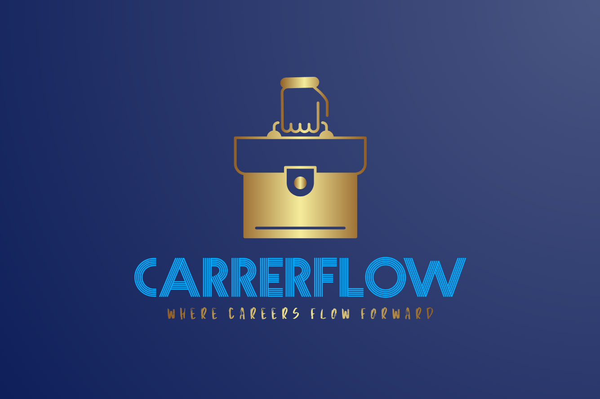

# 🚀 CareerFlow - Where Careers Flow Forward

<div align="center">
  
  
  <br><br>
  
  
  
  **A modern, full-stack job portal application connecting talented professionals with amazing opportunities worldwide.**
  
  [](https://reactjs.org/)
  [](https://vitejs.dev/)
  [](https://convex.dev/)
  [](https://tailwindcss.com/)
  [](https://www.typescriptlang.org/)
</div>

---

## 📋 Table of Contents

- [🎯 Overview](#-overview)
- [✨ Features](#-features)
- [🛠️ Tech Stack](#️-tech-stack)
- [🚀 Getting Started](#-getting-started)
- [📁 Project Structure](#-project-structure)
- [🔧 Configuration](#-configuration)
- [📱 User Roles](#-user-roles)
- [🎨 UI Components](#-ui-components)
- [🗄️ Database Schema](#️-database-schema)
- [🔐 Authentication](#-authentication)
- [📊 API Endpoints](#-api-endpoints)
- [🚀 Deployment](#-deployment)
- [🤝 Contributing](#-contributing)
- [📄 License](#-license)

---

## 🎯 Overview

CareerFlow is a comprehensive job portal platform that bridges the gap between job seekers and employers. Built with modern web technologies, it provides an intuitive, secure, and feature-rich experience for both candidates and recruiters.

### 🌟 Key Highlights

- **Dual User Experience**: Seamless interfaces for both job seekers and employers
- **Real-time Updates**: Live notifications and status tracking
- **Global Reach**: Support for worldwide job opportunities
- **Modern UI/UX**: Beautiful, responsive design with dark theme
- **Secure Platform**: Robust authentication and data protection
- **File Management**: Resume upload and management system
- **Interview Scheduling**: Built-in interview coordination tools

---

## ✨ Features

### 👥 For Job Seekers
- **Job Search & Discovery**: Advanced filtering by location, experience, salary, and more
- **Application Tracking**: Real-time status updates for all applications
- **Resume Management**: Upload, organize, and manage multiple resumes
- **Saved Jobs**: Bookmark interesting positions for later application
- **Profile Management**: Comprehensive professional profiles with skills and experience
- **Notifications**: Stay updated with application status and new opportunities

### 🏢 For Employers
- **Job Posting**: Create detailed job listings with rich descriptions
- **Candidate Management**: Review, shortlist, and manage applications
- **Company Profiles**: Showcase company culture and benefits
- **Interview Scheduling**: Coordinate interviews with candidates
- **Analytics**: Track job performance and application metrics
- **Team Collaboration**: Manage multiple recruiters and hiring teams

### 🔧 Platform Features
- **Responsive Design**: Optimized for desktop, tablet, and mobile
- **Dark Theme**: Modern, eye-friendly interface
- **Real-time Updates**: Live data synchronization
- **File Storage**: Secure document management
- **Search & Filtering**: Advanced search capabilities
- **Social Authentication**: Google and email-based login
- **Notification System**: In-app and email notifications

---

## 🛠️ Tech Stack

### Frontend
- **React 18.3.1** - Modern UI library with hooks and context
- **Vite 5.3.4** - Fast build tool and development server
- **React Router DOM 6.26.0** - Client-side routing
- **Tailwind CSS 3.4.7** - Utility-first CSS framework
- **Radix UI** - Accessible component primitives
- **Lucide React** - Beautiful icon library
- **React Hook Form** - Form handling and validation
- **Zod** - Schema validation

### Backend & Database
- **Convex 1.27.5** - Real-time backend-as-a-service
- **TypeScript** - Type-safe development
- **File Storage** - Document and image management

### Authentication & Security
- **Built-in AuthContext** - Lightweight local/session auth for demo use
- **JWT (optional)** - For token-based flows if integrated later
- **Social Login** - Google OAuth integration (demo)

### Development Tools
- **ESLint** - Code linting and formatting
- **PostCSS** - CSS processing
- **Autoprefixer** - CSS vendor prefixing

---

## 🚀 Getting Started

### Prerequisites

- **Node.js** (v18 or higher)
- **npm** or **yarn**
- **Convex Account** - [Sign up here](https://convex.dev/)

### Installation

1. **Clone the repository**
   ```bash
   git clone https://github.com/yourusername/careerflow.git
   cd careerflow
   ```

2. **Install dependencies**
   ```bash
   npm install
   ```

3. **Environment Setup**
   Create a `.env.local` file in the root directory:
   ```env
   VITE_CONVEX_URL=your-convex-client-url
   VITE_GOOGLE_CLIENT_ID=your-google-oauth-client-id (optional)
   VITE_FACEBOOK_APP_ID=your-facebook-app-id (optional)
   ```

4. **Convex Setup**
   ```bash
   npx convex dev
   ```

5. **Start the development server**
   ```bash
   npm run dev
   ```

6. **Open your browser**
   Navigate to `http://localhost:5173`

### Build for Production

```bash
npm run build
npm run preview
```

---

## 📁 Project Structure

```
CareerFlow/
├── 📁 public/                 # Static assets
│   ├── companies/            # Company logos
│   ├── resumes/              # Resume storage
│   └── images/               # General images
├── 📁 src/
│   ├── 📁 api/               # API service functions
│   ├── 📁 components/        # Reusable UI components
│   │   ├── ui/               # Base UI components
│   │   └── *.jsx             # Feature components
│   ├── 📁 context/           # React context providers
│   ├── 📁 data/              # Static data files
│   ├── 📁 hooks/             # Custom React hooks
│   ├── 📁 layouts/           # Page layout components
│   ├── 📁 lib/               # Utility libraries
│   ├── 📁 pages/             # Page components
│   └── 📁 utils/             # Helper functions
├── 📁 convex/                # Backend functions and schema
│   ├── schema.ts             # Database schema
│   ├── users.ts              # User management
│   ├── jobs.ts               # Job operations
│   ├── applications.ts       # Application handling
│   └── companies.ts          # Company management
├── package.json              # Dependencies and scripts
├── tailwind.config.js        # Tailwind configuration
├── vite.config.js            # Vite configuration
└── README.md                 # This file
```

---

## 🔧 Configuration

### Tailwind CSS
The project uses Tailwind CSS with custom configuration for:
- Dark theme by default
- Custom color palette
- Responsive breakpoints
- Animation utilities

### Vite Configuration
- React plugin for JSX support
- Path aliases (`@` for `src/`)
- Development server configuration

### Convex Backend
- Real-time database
- Serverless functions
- File storage integration
- Authentication middleware

---

## 📱 User Roles

### 👤 Candidate
- **Profile Management**: Create and maintain professional profiles
- **Job Search**: Browse and filter job opportunities
- **Applications**: Apply to jobs and track status
- **Resume Management**: Upload and organize resumes
- **Saved Jobs**: Bookmark interesting positions

### 🏢 Recruiter
- **Company Management**: Create and manage company profiles
- **Job Posting**: Create detailed job listings
- **Candidate Review**: Review applications and profiles
- **Interview Scheduling**: Coordinate interview sessions
- **Team Management**: Collaborate with hiring teams

---

## 🎨 UI Components

The application uses a comprehensive design system built on:

- **Radix UI Primitives**: Accessible, unstyled components
- **Custom Components**: Tailored for the job portal use case
- **Responsive Design**: Mobile-first approach
- **Dark Theme**: Modern, professional appearance
- **Animation**: Smooth transitions and micro-interactions

### Key Components
- `JobCard` - Job listing display
- `ApplicationCard` - Application status display
- `InterviewScheduler` - Interview coordination
- `NotificationBell` - Real-time notifications
- `ProtectedRoute` - Authentication guards

---

## 🗄️ Database Schema

### Core Tables

#### Users
```typescript
{
  email: string
  firstName: string
  lastName: string
  role: "candidate" | "recruiter"
  skills: string[]
  experienceYears: number
  // ... additional profile fields
}
```

#### Jobs
```typescript
{
  title: string
  description: string
  location: string
  jobType: "full-time" | "part-time" | "contract" | "internship"
  experienceLevel: "entry" | "mid" | "senior" | "lead"
  salaryMin: number
  salaryMax: number
  // ... additional job fields
}
```

#### Applications
```typescript
{
  candidateId: string
  jobId: string
  status: "pending" | "reviewed" | "shortlisted" | "interviewed" | "hired"
  coverLetter: string
  resumeUrl: string
  // ... additional application fields
}
```

#### Companies
```typescript
{
  name: string
  description: string
  logoUrl: string
  industry: string
  companySize: string
  // ... additional company fields
}
```

---

## 🔐 Authentication

CareerFlow currently uses an internal `AuthContext` for simplified demo authentication (email/password and social via Google) stored in localStorage. No external auth provider is required.

### Authentication Flow
1. User signs up/in via `AuthContext`
2. Profile creation/update in Convex database
3. Role assignment (candidate/recruiter)
4. Access to role-specific features via `ProtectedRoute`

---

## 📊 API Endpoints

### User Management
- `GET /api/users` - Get user profile
- `PUT /api/users` - Update user profile
- `POST /api/users` - Create user profile

### Job Management
- `GET /api/jobs` - List jobs with filters
- `POST /api/jobs` - Create new job
- `PUT /api/jobs/:id` - Update job
- `DELETE /api/jobs/:id` - Delete job

### Application Management
- `GET /api/applications` - Get user applications
- `POST /api/applications` - Submit application
- `PUT /api/applications/:id` - Update application status

### Company Management
- `GET /api/companies` - List companies
- `POST /api/companies` - Create company
- `PUT /api/companies/:id` - Update company

---

## 🚀 Deployment

### Vercel Deployment
1. Connect your GitHub repository to Vercel
2. Configure environment variables
3. Deploy automatically on push to main branch

### Environment Variables
```env
VITE_CONVEX_URL=your-convex-client-url
VITE_GOOGLE_CLIENT_ID=your-google-oauth-client-id (optional)
VITE_FACEBOOK_APP_ID=your-facebook-app-id (optional)
```

### Build Process
```bash
npm run build
```

The build creates optimized production files in the `dist/` directory.

---

## ⚡ Performance Optimizations

- Route-level code splitting with lazy-loaded pages and skeleton fallbacks
- Virtualized job lists for smooth rendering at scale
- Smart prefetching of likely next routes via `usePrefetch`
- Service Worker caching for static assets with update prompts
- Convex realtime queries/mutations for instant UI updates
- Memoization and debounced inputs for heavy computations

---

## 🤝 Contributing

We welcome contributions! Please follow these steps:

1. **Fork the repository**
2. **Create a feature branch**
   ```bash
   git checkout -b feature/amazing-feature
   ```
3. **Commit your changes**
   ```bash
   git commit -m 'Add amazing feature'
   ```
4. **Push to the branch**
   ```bash
   git push origin feature/amazing-feature
   ```
5. **Open a Pull Request**

### Development Guidelines
- Follow the existing code style
- Write meaningful commit messages
- Add tests for new features
- Update documentation as needed

---

## 📄 License

This project is licensed under the MIT License - see the [LICENSE](LICENSE) file for details.

---

## 📞 Support

- **Email**: hello@careerflow.com
- **Website**: www.careerflow.com
- **Location**: Goa, India

---

<div align="center">
  <p>Made with ❤️ by the CareerFlow Team</p>
  <p>© 2025 CareerFlow. All rights reserved.</p>
</div>